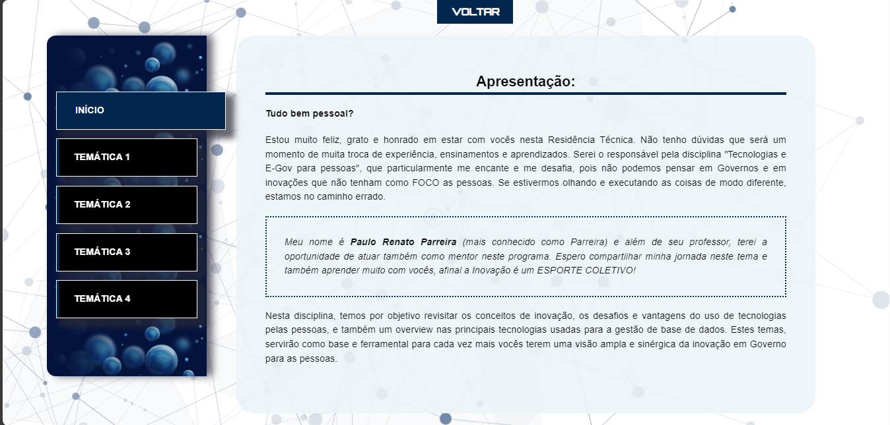

# Projeto Original

> Projeto original do curso de pós-graduação **Especialização em Inovação, Transformação Digital e E-Gov**. Disciplina: **Tecnologia e E-gov para as Pessoas.**
>> Atribuições estágio --> design de páginas HTML.
>>> UNICENTRO - NEAD

> Marcos Vinicius Schimaichel Boava
>> mboava@unicentro.br
>>> Projeto realizado no Estágio Superivisionado DECOMP UNICENTRO 

## Capturas de tela do projeto

### Seção inicial

    
    
Apresentação da disciplina

### Conteúdos da disciplina

    
    
Tab "Live" - Temática 1

 

    
    
Tab "Think" - Temática 1

### Layout atualizado

    
    
Exemplo na Apresentação

